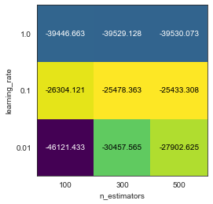

# Code Back Ground
There are no extra installs required for this notebook, simply run all of the cells.

# Proprocessing
The house price dataset contains 79 features with a mix of categorical and numerical features. Through inspection of the data, it was determined that some of the numerical features were actually categorical or ordinal features. Also, many of the categorical features had 'NA' as a value which pandas exported as NaN. Steps were taken to convert the NaN values of these features back to 'NA'. Other categorical features were also missing values, these were replaced with the most common value in each column.

# Model Selection
The two models I used were RandomForestRegression() and GradientBoostingRegression(). To understand the performance of both models, I fit the training data using five-fold cross validation. RFR seemed to be overfitting the data because it had a high training nRMS with a low validation nRMS so I proceeded to hyperparameter tuning using only GBR. I used GridSearchCV() with GBR to find the best parameters:

Best parametars for GBR:
- 'learning_rate': 0.1
- 'n_estimators': 500}
Best nRMS:
- -25433.31
- improvement of 1000[USD] in nRMS score over default parameters

Grid Search Results Plot

# Results
I used the best GBR model to predict sales prices of homes on the Kaggle test dataset. I exported the predictions to a csv and submitting to the Kaggle competition. My Kaggle Score was 0.13164 and I scored 1519 on the leaderboard.

# Interpretation
Through my experience with this Kaggle competition I learned the importance of feature engineering and  to consider the types of features in the data. I also learned about technigues such as Imputing which allowed me to fill in missing data rather than removing data which I understand is immensly important in real world scenarios. I also learned how easy it is for ensemble models to overfit the data.
